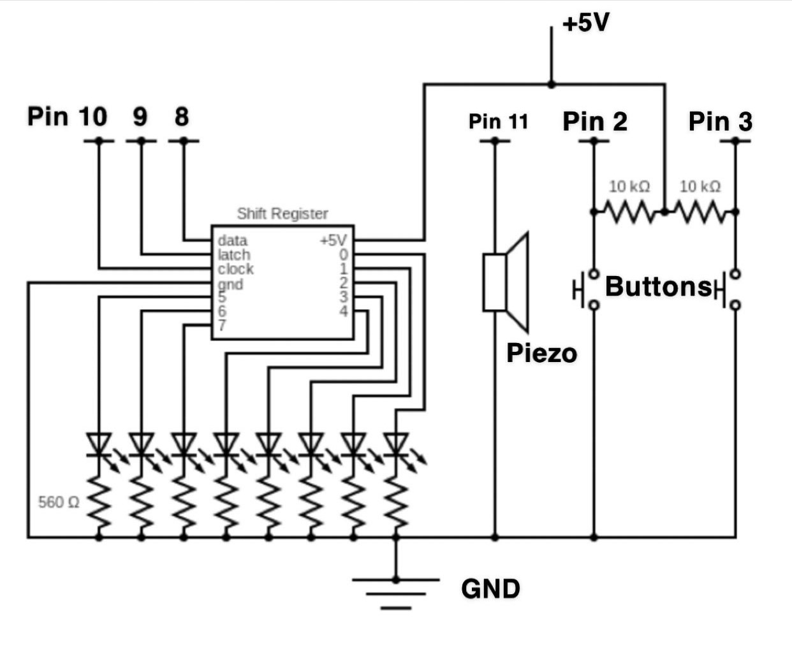

# Morse Keyboard

## Description
### Concept
#### Telegraphs and Morse Code
Telegraphs are one of the first long-distance communication technologies, first developed in the 1800's. A telegraph has a lever button that a user can push to send an electrical signal to another telegraph (the two telegrphs are physically connectced by a wire) and a clicker than converts a recieved signal into a short or long click sound. These signals represent either a dot (a short click) or a dash (a long click). To convey information through these dots and dashs Morse code was created. Morse code is a system for categorizing sequences of dots and dashes to represent alphanumeric character, a->z and 0->9. For example, 'a' would be represented in morse code as '*-" (dot dash).

#### Music Scales
A music scale typically includes 8 notes, where each note is denoted as a, b, c, d, e, f, or g (there are also sharp and flat notes which are notes between notes), with the first note repeated at the end but with a higher pitch. Combining notes and scales in different orders is the backbone for the vast majority of modern music.

#### Telegraphs and Scales
Telegraphs and instruments are alike as to use them a user must memorize Morse code or music scales to operate each device efficiently. To help with this memorization I have developed Morse Keyboard. Morse Keyboard is an interactive device to help teach introductory knowledge for Morse code and music scales. Specifically, Morse Keyboard helps users learn the C Major scale (this is one of the most common scales in music, it consists of the notes cdefgabc, in that order), and each notes Morse code representation. 
Morse Keyboard is operated with two buttons, the dot button and the dash button. A arduino will try to convert a user's input to a character in Morse code. If the input matches a note character, a to g and k, then an LED will light to indicate the entered charater and the respective note will play. 
k is considered a valid note as Morse code does not differeniate between lower-case and upper-case letter. So, to be able to play the c note at to different pitches a new character, k, was needed.

### Circuit Schema

### Photos

### Video Explanation and Demo

### Functionality
The components for this project are
- an Arduino
- 2 push buttons
- 8 LEDs
- a shift register
- 8 560-ohm resistors
- 2 10k-ohm resistors
- wires
The Arduino uses GPIO pins 2 and 3 for the push button input. Pins 8, 9, and 10 are used for the shift registered data, latch, and clock pins respectively. Finally, pin 11 on the Arduino is used for the Piezo speaker.
As mentioned, the scale of the board is the C Major scale, notes cdefgabk (again, k represents c but at a higher pitch).
To play a note the user must enter the correct sequence of dots and dashes, and on the last dot or dash the user must continue to press the button and press the other button at the same time. This will inform the Arduino that a sewuence has been entered and the user would like that note to be played.

## References
The following sources were used for this project
- https://oomlout.com/oom.php/products/ardx/circ-05.html
- https://oomlout.com/oom.php/products/ardx/circ-06.html
- https://oomlout.com/oom.php/products/ardx/circ-07.html
